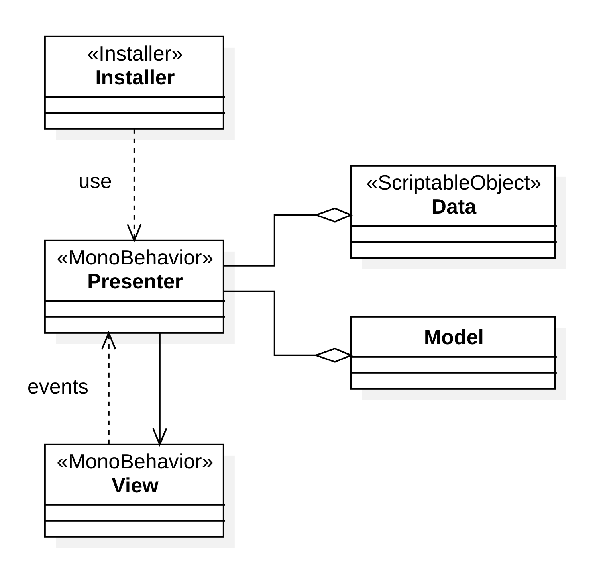
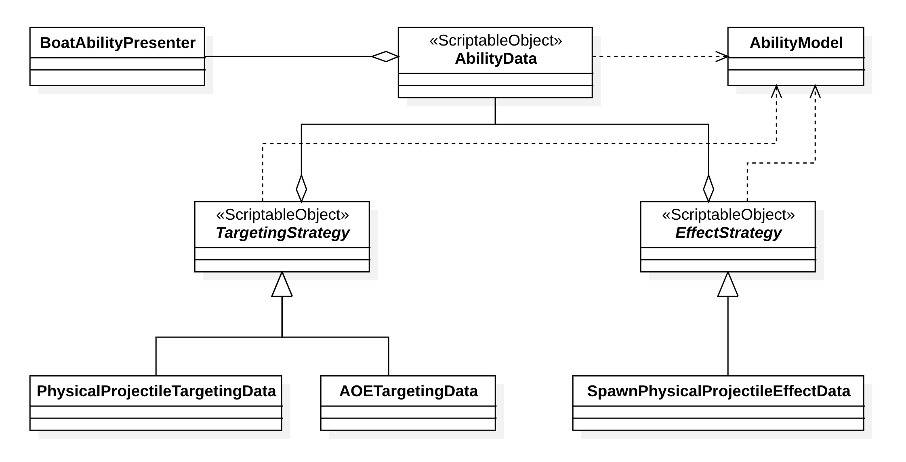

# Introduction

The Skull Bay is a casual game where the player controls a pirate ship attacking to steal loots of other boats.

## How to play

- **WASD** – Move
- **1** – Shoot cannon
- **Left mouse** – Confirm shooting

## Features

- Physics-based Movement with Rigidbody
- Physics-based Projectile: Apply Kinematic equations and Newton’s Law of Inertia
- AI Behaviors:
  - Spawn in a chosen area
  - Physics-based auto rotation to target position
  - Patrol in a chosen area
  - Drop loot on death
- Combat system:
  - Health system
  - Ability system with Targeting strategy and Effect strategy
- Hunger system: Currently behaves as a time limitation of a level.

# Tech stack

- Game engine: Unity 2022.3.19f1
- Language: C#
- Architectures and Design Patterns:
  - Model – View – Presenter (MVP)
  - Entity – Component – System (ESC – Unity default)
  - Strategy Pattern
- Packages:
  - Zenject 9.2.0: Dependency Injection

## MVP and Dependency Injection with Zenject

As an addition to the original MVP, there are Scriptable Objects called Data. They save the settings, and constants of the system. E.g. Boat max movement speed, Ability aim range, etc.

Compared to Data, the Model is used to represent states and snapshots of data.

# Apply Strategy Pattern to Ability System

